# Adversarial Attacks on Deep Image Classifiers

## Project Overview
This project explores the vulnerability of deep neural networks to adversarial attacks. We implement and evaluate various adversarial attack methods on state-of-the-art image classification models, specifically targeting ResNet-34 pre-trained on ImageNet. The goal is to create minimal perturbations that cause the model to misclassify images, demonstrating the brittleness of deep learning models despite their impressive performance on standard benchmarks.

## Introduction
Deep neural networks have achieved remarkable success in computer vision tasks, yet they remain susceptible to carefully crafted adversarial examples. These are inputs with subtle, often imperceptible modifications that lead to incorrect predictions. This vulnerability poses significant concerns for deploying deep learning systems in security-critical applications.

In this project, we investigate:
1. The basic vulnerability of ResNet-34 to simple Fast Gradient Sign Method (FGSM) attacks
2. More sophisticated iterative attacks using Projected Gradient Descent (PGD)
3. Localized patch attacks that modify only a small portion of the image
4. The transferability of adversarial examples across different model architectures

## Dataset
We used a subset of 500 images from 100 classes of the ImageNet-1K dataset. The dataset preprocessing follows standard ImageNet normalization:
```python
mean_norms = np.array([0.485, 0.456, 0.406])
std_norms = np.array([0.229, 0.224, 0.225])
plain_transforms = transforms.Compose([
    transforms.ToTensor(),
    transforms.Normalize(mean=mean_norms, std=std_norms)
])
```

## Methodology

### Task 1: Baseline Performance
We first established the baseline performance of a pre-trained ResNet-34 model on our test dataset:

```python
pretrained_model = torchvision.models.resnet34(weights='IMAGENET1K_V1')
```

Baseline performance metrics:
- **Top-1 Accuracy: 76.00%**
- **Top-5 Accuracy: 94.20%**

### Task 2: FGSM Attack (Pixel-wise Attack)
The Fast Gradient Sign Method (FGSM) is one of the simplest adversarial attack methods. It performs a single-step update in the direction that maximizes the loss:

```python
# Computing the loss gradient with respect to the input
inputs.requires_grad = True
outputs = pretrained_model(inputs)
loss = F.cross_entropy(outputs, imagenet_labels)
loss.backward()
grad = inputs.grad.data

# Applying FGSM perturbation
perturbed_inputs = inputs + epsilon * grad.sign()
```

For our implementation, we used an attack budget of ε = 0.02, which corresponds to a perturbation of approximately +/-1 in the raw pixel space (0-255).

Performance after FGSM attack:
- **Top-1 Accuracy: 6.00%** (70% absolute drop)
- **Top-5 Accuracy: 35.40%** (58.8% absolute drop)

### Task 3: PGD Attack (Improved Attack)
We implemented Projected Gradient Descent (PGD), an iterative attack method that takes multiple small steps in the direction of the gradient:

```python
# PGD attack
for _ in range(num_steps):
    outputs = pretrained_model(inputs + delta)
    loss_untarget = F.cross_entropy(outputs, imagenet_labels)
    loss_untarget.backward()
    grad = delta.grad.data
    
    # Projected gradient step
    delta = torch.clamp(delta.detach() + alpha * torch.sign(grad), min=-epsilon, max=epsilon)
    delta.requires_grad = True
```

Our implementation used:
- Attack budget: ε = 0.02 (same as FGSM)
- Step size: α = 2/255
- Number of steps: 10
- Random restarts: 1

Performance after PGD attack:
- **Top-1 Accuracy: 0.00%** (100% attack success rate)
- **Top-5 Accuracy: 12.00%** (82.2% absolute drop)

### Task 4: Patch Attack
For the patch attack, we only perturbed a small 32×32 patch of the image but allowed for a larger perturbation magnitude:

```python
# Select random patch location
h, w = inputs.shape[-2:]
x_start = torch.randint(0, h - patch_size, (1,)).item()
y_start = torch.randint(0, w - patch_size, (1,)).item()

# Apply perturbation only to the selected patch
attack_inputs = inputs.clone()
attack_inputs[..., x_start:x_start+patch_size, y_start:y_start+patch_size] += delta
```

Parameters:
- Patch size: 32×32 pixels
- Attack budget: ε = 0.5 (much larger than pixel-wise attacks)
- Step size: α = 50/255
- Number of steps: 10
- Random restarts: 2

Performance after patch attack:
- **Top-1 Accuracy: 38.20%** (37.8% absolute drop)
- **Top-5 Accuracy: 77.00%** (17.2% absolute drop)

### Task 5: Transferability
To evaluate transferability, we tested our adversarial examples on a different model architecture, DenseNet-121:

```python
new_model = torchvision.models.densenet121(weights='IMAGENET1K_V1')
```

## Results

### Performance Summary

#### ResNet-34 (Target Model)
| Dataset | Attack Method | Top-1 Accuracy | Top-5 Accuracy |
|---------|--------------|----------------|----------------|
| Original | None (Baseline) | 76.00% | 94.20% |
| Adv. Set 1 | FGSM | 6.00% | 35.40% |
| Adv. Set 2 | PGD | 0.00% | 10.80% |
| Adv. Set 3 | Patch | 42.00% | 75.60% |

#### DenseNet-121 (Transfer Model)
| Dataset | Attack Method | Top-1 Accuracy | Top-5 Accuracy |
|---------|--------------|----------------|----------------|
| Original | None (Baseline) | 74.80% | 93.60% |
| Adv. Set 1 | FGSM | 65.20% | 89.80% |
| Adv. Set 2 | PGD | 65.80% | 92.00% |
| Adv. Set 3 | Patch | 72.00% | 91.40% |

### Visualizations
For each attack method, we visualized several examples showing:
1. The original image and its true label
2. The perturbed image
3. The noise pattern (magnified for visibility)
4. Model predictions on the perturbed image

These visualizations confirm that the perturbations, especially for FGSM and PGD attacks, are nearly imperceptible to the human eye while successfully fooling the model.

#### FGSM Attack Visualizations
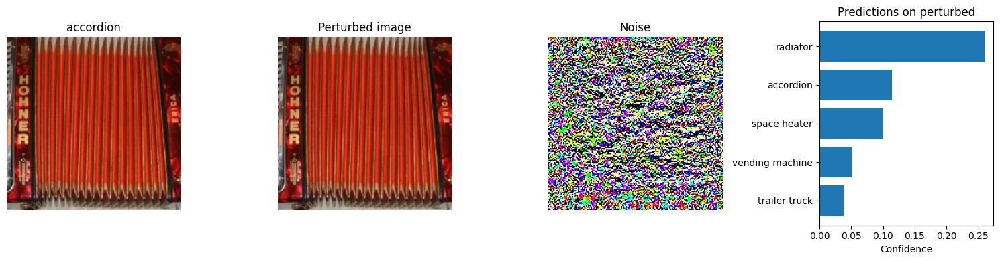
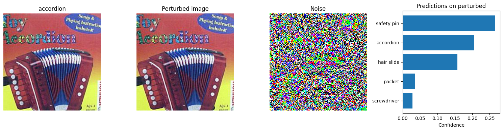
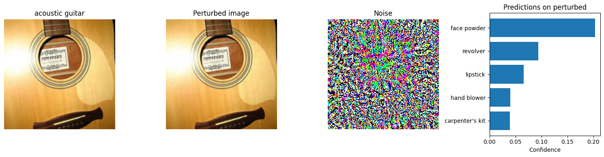
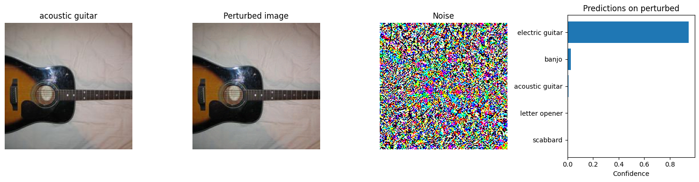
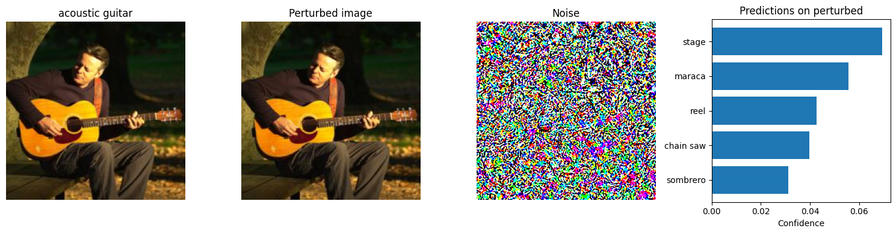

#### PGD Attack Visualizations
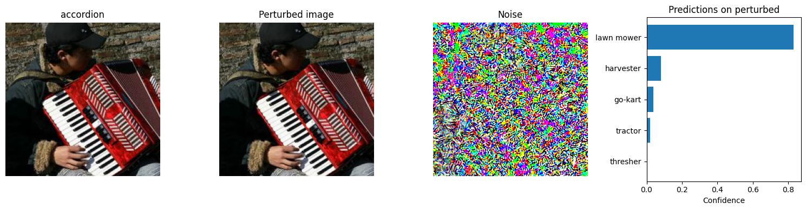
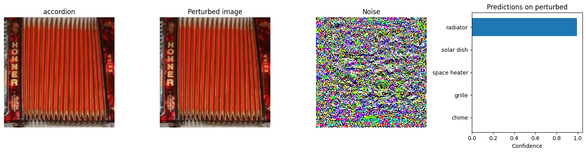
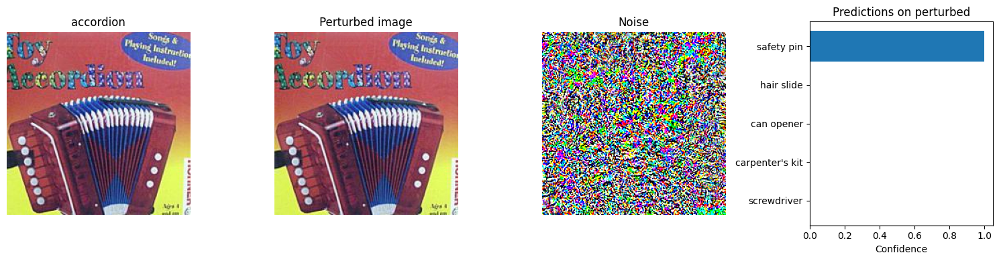
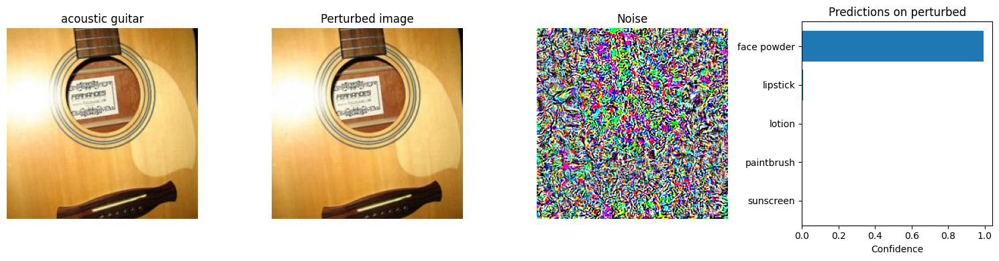
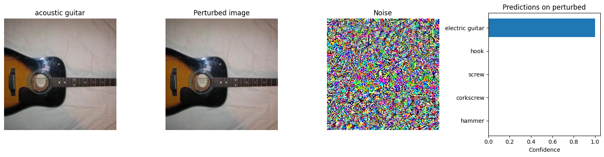

#### Patch Attack Visualizations
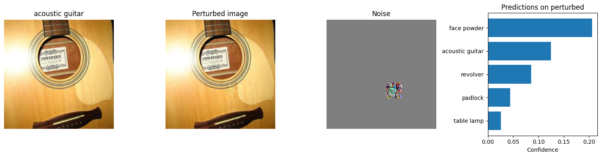
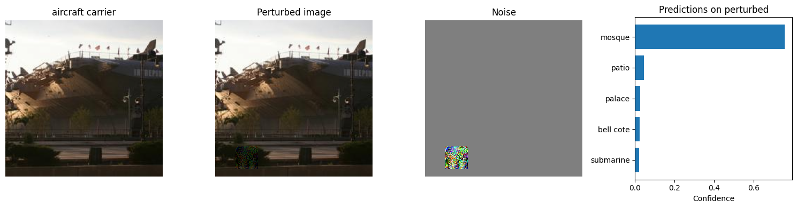
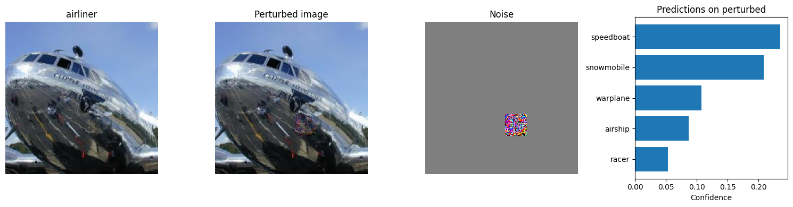
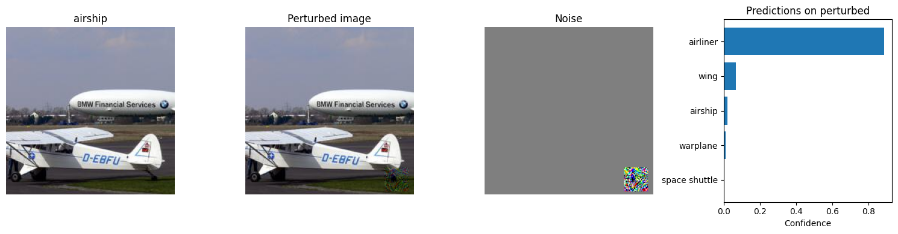
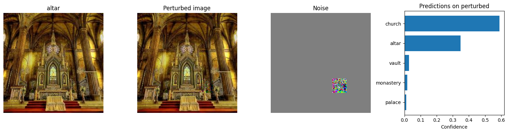


## Discussion

### Attack Effectiveness
- **FGSM** provided a strong baseline attack, reducing top-1 accuracy by 70 percentage points with minimal perturbation.
- **PGD** was the most effective attack, completely breaking the model (0% top-1 accuracy) while maintaining the same perturbation constraint as FGSM.
- **Patch attacks** were less effective overall but still significant, despite only modifying a small portion of the image. They required larger perturbation magnitudes to be effective.

### Transferability Analysis
The study of transferability yielded interesting insights:
- All three attacks transferred to DenseNet-121 to some degree, with performance drops of approximately 9-10% in top-1 accuracy.
- PGD attacks, which were 100% effective against ResNet-34, showed similar transferability to FGSM attacks against DenseNet-121.
- Patch attacks showed the least transferability, with only a 4.4% drop in top-1 accuracy on DenseNet-121.

This suggests that some vulnerabilities are shared across different neural network architectures, possibly due to similarities in their training procedures or architectural design principles.

### Implications and Mitigations
The high effectiveness of these attacks, especially PGD, highlights the vulnerability of deep learning models even when perturbations are minimal. Potential mitigations include:

1. **Adversarial training**: Incorporating adversarial examples during training to improve robustness
2. **Input preprocessing**: Applying transformations to inputs that may disrupt adversarial perturbations
3. **Model ensemble**: Using multiple models with different architectures to detect inconsistent predictions
4. **Feature denoising**: Incorporating layers specifically designed to reduce the impact of adversarial noise

## Conclusion
This project successfully demonstrated the vulnerability of state-of-the-art image classifiers to adversarial attacks. We achieved significant performance degradation with imperceptible perturbations, and showed that these attacks can transfer between different model architectures, albeit with reduced effectiveness.

The results underscore the importance of considering adversarial robustness when deploying deep learning systems, especially in security-critical applications. Future work could explore more sophisticated attack and defense methods, as well as theoretical explanations for the transferability phenomenon observed in our experiments.

