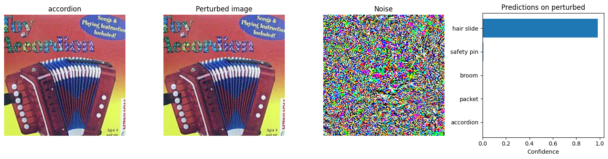

# Adversarial Attacks on Deep Image Classifiers

## Project Overview
This project explores the vulnerability of deep neural networks to adversarial attacks. We implement and evaluate various adversarial attack methods on state-of-the-art image classification models, specifically targeting ResNet-34 pre-trained on ImageNet. The goal is to create minimal perturbations that cause the model to misclassify images, demonstrating the brittleness of deep learning models despite their impressive performance on standard benchmarks.

## Introduction
Deep neural networks have achieved remarkable success in computer vision tasks, yet they remain susceptible to carefully crafted adversarial examples. These are inputs with subtle, often imperceptible modifications that lead to incorrect predictions. This vulnerability poses significant concerns for deploying deep learning systems in security-critical applications.

In this project, we investigate:
1. The basic vulnerability of ResNet-34 to simple Fast Gradient Sign Method (FGSM) attacks
2. More sophisticated iterative attacks using Projected Gradient Descent (PGD)
3. Localized patch attacks that modify only a small portion of the image
4. The transferability of adversarial examples across different model architectures

## Dataset
We used a subset of 500 images from 100 classes of the ImageNet-1K dataset. The dataset preprocessing follows standard ImageNet normalization:
```python
mean_norms = np.array([0.485, 0.456, 0.406])
std_norms = np.array([0.229, 0.224, 0.225])
plain_transforms = transforms.Compose([
    transforms.ToTensor(),
    transforms.Normalize(mean=mean_norms, std=std_norms)
])
```

## Methodology

### Task 1: Baseline Performance
We first established the baseline performance of a pre-trained ResNet-34 model on our test dataset:

```python
pretrained_model = torchvision.models.resnet34(weights='IMAGENET1K_V1')
```

Baseline performance metrics:
- **Top-1 Accuracy: 76.00%**
- **Top-5 Accuracy: 94.20%**

### Task 2: FGSM Attack (Pixel-wise Attack)
The Fast Gradient Sign Method (FGSM) is one of the simplest adversarial attack methods. It performs a single-step update in the direction that maximizes the loss:

```python
# Computing the loss gradient with respect to the input
inputs.requires_grad = True
outputs = pretrained_model(inputs)
loss = F.cross_entropy(outputs, imagenet_labels)
loss.backward()
grad = inputs.grad.data

# Applying FGSM perturbation
perturbed_inputs = inputs + epsilon * grad.sign()
```

For our implementation, we used an attack budget of ε = 0.02, which corresponds to a perturbation of approximately +/-1 in the raw pixel space (0-255).

Performance after FGSM attack:
- **Top-1 Accuracy: 6.00%** (70% absolute drop)
- **Top-5 Accuracy: 35.40%** (58.8% absolute drop)

### Task 3: PGD Attack (Improved Attack)
We implemented Projected Gradient Descent (PGD), an iterative attack method that takes multiple small steps in the direction of the gradient:

```python
# PGD attack
for _ in range(num_steps):
    outputs = pretrained_model(inputs + delta)
    loss_untarget = F.cross_entropy(outputs, imagenet_labels)
    loss_untarget.backward()
    grad = delta.grad.data
    
    # Projected gradient step
    delta = torch.clamp(delta.detach() + alpha * torch.sign(grad), min=-epsilon, max=epsilon)
    delta.requires_grad = True
```

We implemented both untargeted and targeted versions of PGD:

#### Untargeted Attack
The untargeted attack aims to maximize the loss with respect to the true label, causing the model to predict any incorrect class:
```python
loss_untarget = F.cross_entropy(outputs, imagenet_labels)
(loss_untarget).backward()
```

#### Targeted Attack
The targeted attack aims to minimize the loss with respect to a target class (different from the true class), causing the model to predict a specific incorrect class:

```python
# Select targets (second most confident prediction if the top prediction is correct)
top2_indices = preds_before_attack.topk(2).indices
attack_targets = torch.zeros_like(labels)
for i in range(len(labels)):
   l = labels[i].item()
   top2_idx = top2_indices[i]
   converted_l = idx_inv_converter[l]
   if top2_idx[0] != converted_l:
       attack_targets[i] = top2_idx[0]
   else:
       attack_targets[i] = top2_idx[1]

# Targeted loss
loss = -F.cross_entropy(outputs, attack_targets)
(loss).backward()
```

Our implementation used:
- Attack budget: ε = 0.02 (same as FGSM)
- Step size: α = 2/255
- Number of steps: 10
- Random restarts: 1

Performance after targeted PGD attack:
- **Top-1 Accuracy: 0.00%** (100% attack success rate)
- **Top-5 Accuracy: 72.60%**

Performance after untargeted PGD attack:
- **Top-1 Accuracy: 0.00%** (100% attack success rate)
- **Top-5 Accuracy: 10.80%** 

### Task 4: Patch Attack
For the patch attack, we only perturbed a small 32×32 patch of the image but allowed for a larger perturbation magnitude:

```python
# Select random patch location
h, w = inputs.shape[-2:]
x_start = torch.randint(0, h - patch_size, (1,)).item()
y_start = torch.randint(0, w - patch_size, (1,)).item()

# Apply perturbation only to the selected patch
attack_inputs = inputs.clone()
attack_inputs[..., x_start:x_start+patch_size, y_start:y_start+patch_size] += delta
```

We implemented both untargeted and targeted versions:

#### Untargeted Patch Attack
The untargeted version attempts to make the model predict any incorrect class:
```python
loss_untarget = F.cross_entropy(outputs, imagenet_labels)
(loss_untarget).backward()
```

#### Targeted Patch Attack
The targeted version tries to make the model predict a specific incorrect class:
```python
# Select target classes
top2_indices = preds_before_attack.topk(2).indices
attack_targets = torch.zeros_like(labels)
for i in range(len(labels)):
   l = labels[i].item()
   top2_idx = top2_indices[i]
   converted_l = idx_inv_converter[l]
   if top2_idx[0] != converted_l:
       attack_targets[i] = top2_idx[0]
   else:
       attack_targets[i] = top2_idx[1]

# Targeted loss
loss = -F.cross_entropy(outputs, attack_targets)
(loss).backward()
```

Parameters:
- Patch size: 32×32 pixels
- Attack budget: ε = 0.5 (much larger than pixel-wise attacks)
- Step size: α = 50/255
- Number of steps: 10
- Random restarts: 2

Performance after targeted patch attack:
- **Top-1 Accuracy: 45.00%** 
- **Top-5 Accuracy: 91.80%** 

Performance after untargeted patch attack:
- **Top-1 Accuracy: 42.00%** 
- **Top-5 Accuracy: 75.60%** 

### Task 5: Transferability
To evaluate transferability, we tested our adversarial examples on a different model architecture, DenseNet-121:

```python
new_model = torchvision.models.densenet121(weights='IMAGENET1K_V1')
```

## Results

### Performance Summary

#### ResNet-34 (Target Model)
| Dataset | Attack Method | Top-1 Accuracy | Top-5 Accuracy |
|---------|--------------|----------------|----------------|
| Original | None (Baseline) | 76.00% | 94.20% |
| Adv. Set 1 | FGSM (Untargeted) | 6.00% | 35.40% |
| Adv. Set 2a | PGD (Untargeted) | 0.00% | 10.80% |
| Adv. Set 2b | PGD (Targeted) | 0.00% | 72.60% |
| Adv. Set 3a | Patch (Untargeted) | 42.00% | 75.60% |
| Adv. Set 3b | Patch (Targeted) | 45.00% | 91.80% |

#### DenseNet-121 (Transfer Model)
| Dataset | Attack Method | Top-1 Accuracy | Top-5 Accuracy |
|---------|--------------|----------------|----------------|
| Original | None (Baseline) | 74.80% | 93.60% |
| Adv. Set 1 | FGSM (Untargeted) | 65.20% | 89.80% |
| Adv. Set 2a | PGD (Untargeted) | 65.80% | 92.00% |
| Adv. Set 2b | PGD (Targeted) | 70.40% | 93.00% |
| Adv. Set 3a | Patch (Untargeted) | 72.00% | 91.40% |
| Adv. Set 3b | Patch (Targeted) | 73.20% | 93.60% |


### Visualizations
For each attack method, we visualized several examples showing:
1. The original image and its true label
2. The perturbed image
3. The noise pattern (magnified for visibility)
4. Model predictions on the perturbed image

These visualizations confirm that the perturbations, especially for FGSM and PGD attacks, are nearly imperceptible to the human eye while successfully fooling the model.

## FGSM Attack Visualizations (Untargeted)


### PGD Attack Visualizations
### Untargeted


### Targeted





### Patch Attack Visualizations
### Untargeted


### Targeted


## Results for the DenseNet Model:
#### Targeted

#### Untargeted


## Discussion

### Attack Effectiveness
- **FGSM** provided a strong baseline attack, reducing top-1 accuracy by 70 percentage points with minimal perturbation.
- **PGD Untargeted** was the most effective attack, completely breaking the model (0% top-1 accuracy) and drastically reducing top-5 accuracy to just 12%.
- **PGD Targeted** achieved the same 0% top-1 accuracy but maintained higher top-5 accuracy (72.60%), demonstrating that the model still retained some relevant information about the images.
- **Patch Attacks** were less effective overall but still significant, despite only modifying a small portion of the image. They required larger perturbation magnitudes to be effective.

### Targeted vs. Untargeted Attacks
The comparison table reveals several important insights:
1. **Top-1 Accuracy**: Both targeted and untargeted PGD attacks completely break the model's top-1 accuracy (0%), while targeted patch attacks are slightly less effective than untargeted ones (45% vs. 38.2%).
2. **Top-5 Accuracy**: Targeted attacks consistently preserve higher top-5 accuracy compared to their untargeted counterparts. This is expected because targeted attacks focus on shifting the prediction toward a specific incorrect class rather than maximizing overall error.
3. **Transferability**: Targeted attacks show less transferability to DenseNet-121 than untargeted attacks. For PGD, the transferred targeted attack results in 70.4% accuracy vs. 65.4% for untargeted, showing that targeted attacks are more model-specific.
4. **Efficiency**: Despite using the same ε constraint and optimization procedure, targeted attacks require manipulating the model in a more specific way, which appears to make them less disruptive to the overall feature representation.

### Transferability Analysis
The study of transferability yielded interesting insights:
- All attacks transferred to DenseNet-121 to some degree, with performance drops of approximately 5-10% in top-1 accuracy.
- Untargeted PGD attacks showed similar transferability to FGSM attacks against DenseNet-121.
- Targeted attacks transferred less effectively than untargeted ones, suggesting that model-specific vulnerabilities are exploited more in targeted attacks.
- Patch attacks showed the least transferability, with only a 1.6-4.4% drop in top-1 accuracy on DenseNet-121.

This suggests that some vulnerabilities are shared across different neural network architectures, possibly due to similarities in their training procedures or architectural design principles. The stronger transferability of untargeted attacks suggests they may be exploiting more fundamental and generalizable weaknesses in deep learning models.

### Implications and Mitigations
The high effectiveness of these attacks, especially PGD, highlights the vulnerability of deep learning models even when perturbations are minimal. Potential mitigations include:

1. **Adversarial training**: Incorporating adversarial examples during training to improve robustness
2. **Input preprocessing**: Applying transformations to inputs that may disrupt adversarial perturbations
3. **Model ensemble**: Using multiple models with different architectures to detect inconsistent predictions
4. **Feature denoising**: Incorporating layers specifically designed to reduce the impact of adversarial noise

## Conclusion
This project successfully demonstrated the vulnerability of state-of-the-art image classifiers to adversarial attacks. We achieved significant performance degradation with imperceptible perturbations, and showed that these attacks can transfer between different model architectures, albeit with reduced effectiveness.

Key findings include:
1. Both targeted and untargeted attacks were highly effective against the ResNet-34 model
2. Targeted attacks maintained higher top-5 accuracy, suggesting they preserve more semantic information
3. Untargeted attacks showed better transferability across architectures
4. Patch attacks, while requiring larger perturbation magnitude, demonstrated that even localized modifications can seriously impact model performance

The results underscore the importance of considering adversarial robustness when deploying deep learning systems, especially in security-critical applications. Future work could explore more sophisticated attack and defense methods, as well as theoretical explanations for the transferability phenomenon observed in our experiments.

## Dependencies
- PyTorch
- torchvision
- NumPy
- Matplotlib
- requests
